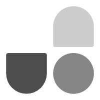
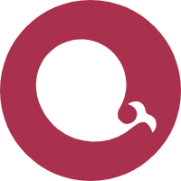
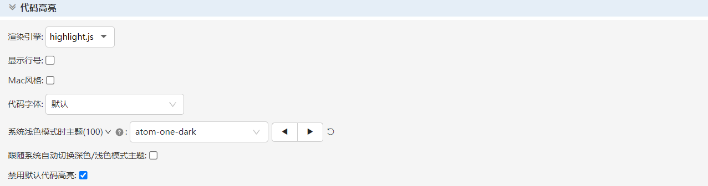
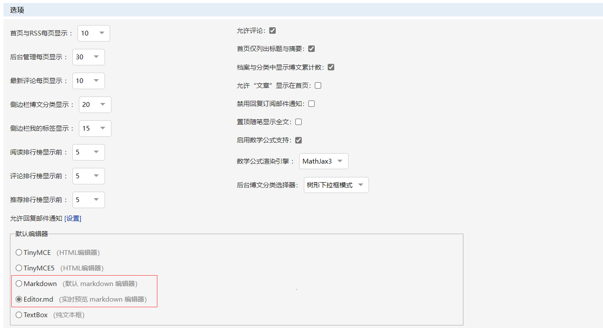
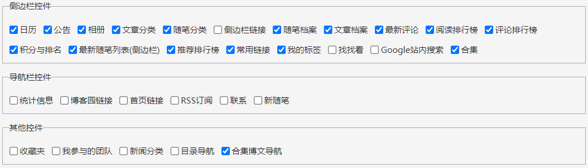
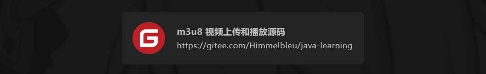
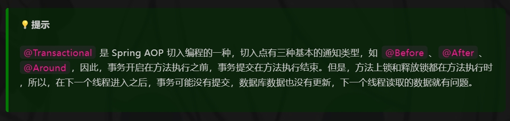
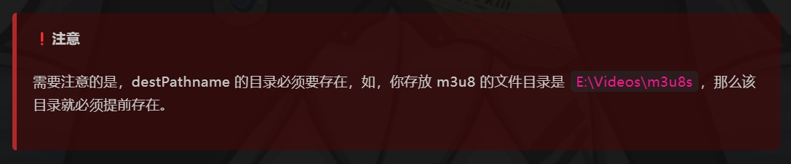

<p align="center">CNBLOGS-THEME-BLEU</p>

<p align="center">
博客园主题
</p>

<p>

<div style="display: flex; justify-content: space-between;">

<div align="center">

<p align="center">Vue</p>
</div>

<div align="center" >

<p align="center">TypeScript</p>
</div>

<div align="center">

<p align="center">UnoCSS</p>
</div>

<div align="center">

<p align="center">Vite</p>
</div>

</div>

<div style="display: flex; justify-content: space-between;">

<div align="center">

<p align="center">Fancyapps</p>
</div>

<div align="center">

<p align="center">Axios</p>
</div>

<div align="center">

<p align="center">Echarts</p>
</div>

<div align="center">

<p align="center">ElementPlus</p>
</div>

<div align="center">

<p align="center">Highlight</p>
</div>

</div>

</p>

# 二次开发

```bash
# 克隆代码
git clone git@github.com:Himmeltala/cnblogs-theme-bleu.git
# 进入目录
cd cnblogs-theme-bleu
# 安装依赖
pnpm install
# 本地调试
pnpm dev
# 编译发布
pnpm build
```

# 基本设置


- 开启 JS 权限。
- 博客皮肤请选择 Custom。

## 代码高亮



- 禁用默认代码高亮。
- 其余设置可选，但用处不大。

## 博客选项



- 编辑器推荐选择 markdown，主题特性是基于 markdown 编辑的文本内容进行开发的。
- 数学公式必须选择 MathJax3，其余的选项可以自行设置。

## 控件设置



上图所示控件选项仅供参考。

## 页首 HTML 代码

```html
<!-- 移除不必要的 DOM -->
<script>
  $("head > link").remove();
  $("#top_nav").remove();
</script>

<!-- 主题样式 -->
<link
  rel="stylesheet"
  href="https://blog-static.cnblogs.com/files/blogs/666252/index-bleu.css?t=2024127009" />

<!-- 加载动画 CSS -->
<style>
  #home {
    display: none !important;
  }

  .loading {
    z-index: 9999999;
    background-color: #222222;
    position: absolute;
    left: 0;
    top: 0;
    height: 100vh;
    width: 100vw;
    display: flex;
    flex-wrap: nowrap;
    flex-direction: row;
    align-content: center;
    justify-content: center;
    align-items: center;
  }

  .triangle1 {
    width: 0;
    height: 0;
    border-style: solid;
    border-width: 4rem 4rem 0 0;
    border-color: #354952 transparent transparent transparent;
    margin: 0 auto;
    animation: triangle1-start 1s ease-in-out infinite normal;
  }

  .triangle2 {
    width: 0;
    height: 0;
    border-style: solid;
    border-width: 0 0 4rem 4rem;
    border-color: transparent transparent #df1a54 transparent;
    margin: -4rem auto 0;
    animation: triangle2-start 1s ease-in-out infinite alternate;
  }

  @keyframes triangle1-start {
    0% {
      transform: rotate(-360deg);
    }

    100% {
    }
  }

  @keyframes triangle2-start {
    0% {
      transform: rotate(360deg);
    }

    100% {
    }
  }
</style>

<!-- 自定义 CSS 变量，例如修改文章字体、代码块字体 -->
<style type="text/css" title="global-stylesheet"></style>

<!-- 加载动画 HTML 结构 -->
<div class="loading">
  <div>
    <div class="triangle1"></div>
    <div class="triangle2"></div>
  </div>
</div>
```

## 页脚 HTML 代码

```html
<!-- 主题配置 -->
<script>
  // 主题的配置对象
  window.__BLEU_CONFIG__ = {};
</script>
<!-- 主题 JS -->
<script
  type="module"
  src="https://blog-static.cnblogs.com/files/blogs/666252/index-bleu.js?t=2024127009"></script>
```

# 主题特性

## 传送门

区别于普通的文字链接，传送门居中，是一个卡片的链接，可以展示封面、标题和链接。

```md
<pot>
  title:(m3u8 视频上传和播放源码) link:(https://gitee.com/Himmelbleu/java-learning)
  cover:(https://www.infocode.com.cn/blog/wp-content/uploads/2021/10/f8fba7a2f3c35d3d7c16892b38ba4785.jpg)
</pot>
```



## 提示块

提示块可以让我们写下一些提示，这块内容会被绿色背景包裹，按照以下格式：

```md
tip:[start]
`@Transactional` 是 Spring AOP 切入编程的一种，切入点有三种基本的通知类型，如 `@Before`、`@After`、`@Around`，因此，事务开启在方法执行之前，事务提交在方法执行结束。但是，方法上锁和释放锁都在方法执行时，所以，在下一个线程进入之后，事务可能没有提交，数据库数据也没有更新，下一个线程读取的数据就有问题。
tip:[end]
```

以 `tip:[start]` 开始，以 `tip:[end]` 结尾，把提示内容写在中间。写完之后，打开随笔页面，就可以查看到效果：



## 注意块

注意块可以让我们写下一些注意，这块内容会被红色背景包裹，按照以下格式：

```md
war:[start]
需要注意的是，destPathname 的目录必须要存在，如，你存放 m3u8 的文件目录是 `E:\Videos\m3u8s`，那么该目录就必须提前存在。
war:[end]
```

以 `war:[start]` 开始，以 `war:[end]` 结尾，把注意内容写在中间。写完之后，打开随笔页面，就可以查看到效果：



## 代码块标注

有时候代码块需要特意说明是哪个文件的，或者说明文件的路径等标注信息，在文本中直接说明有点繁琐，因此你只需要按照以下格式就可以实现一个代码块标注。

在代码块内第一行写上代码块标注。

`file:[src/math_utils.js]`

## 代码块删除行或增加行高亮

在编写文档时，标注代码块中某些行较上一次的改动，你只需要使用以下格式就可以让你的代码块中某些行呈现删除或增加的高亮背景。

- 删除格式：`del:[xxxxxxxxxxxxxx]:del`
- 增加格式：`add:[xxxxxxxxxxxx]:add`

```js
del:[function add(x, y) {
function calc(x, y) {]:del
  add:[return x + y
  return y + x
}]:add
```

## 代码块行高亮提示

在编写文档时，代码块中某些行需要额外注意时，你只需要使用以下格式就可以让你的代码块中某些行呈现高亮背景。

格式：`lit:[]`

```js
lit:[function add(x, y) {
function calc(x, y) {
  return x + y
  return y + x
}]:lit
```

## 主题更新

因博客园有缓存，更改 `https://blog-static.cnblogs.com/files/blogs/666252/index-bleu.js?t=20231251645` 链接中 `t`
等于的值，可以是日期，也可以是其他值。更改完成之后，就可以获取到最新的主题。

# 配置主题

## theme

- 类型：object
- 是否必填：否

```html
<link
  rel="stylesheet"
  href="https://chinese-fonts-cdn.deno.dev/packages/lxgwwenkaibright/dist/LXGWBright-Regular/result.css" />
<link
  rel="stylesheet"
  href="https://cdn.bootcdn.net/ajax/libs/hack-font/3.3.0/web/hack-subset.min.css" />
```

以下是页面字体和代码块字体，变量很多，持续增加可自定义 CSS 变量。

```js
window.__BLEU_CONFIG__ = {
  theme: {
    codeFamily: "Hack",
    mainFamily: "LXGW Bright",
    codeLineHeight: 1.7,
    mainLineHeight: 2
  }
};
```

## icon

- 类型：string
- 是否必填：否

网站 icon，显示在浏览器标签页。

```js
window.__BLEU_CONFIG__ = {
  icon: ""
};
```

## signature

- 类型：string
- 是否必填：否

个性签名显示在博客信息底部，文字超过两行会被隐藏（出于布局的考虑）。

```js
window.__BLEU_CONFIG__ = {
  signature: "Time tick away, dream faded away."
};
```

## status

- 类型：string
- 是否必填：否

插入一个 emoji 表情，表示自己的状态，例如：🐟 表示自己在摸鱼中。

```js
window.__BLEU_CONFIG__ = {
  status: "🐟"
};
```

## avatar

- 类型：string
- 是否必填：否

个人头像显示在博客信息顶部，请插入不宜过大的网络图片。

```js
window.__BLEU_CONFIG__ = {
  avatar: ""
};
```

## images

- 类型：object
- 是否必填：否

该配置项包括了背景图片、首页轮播图、文章和随笔列表封面图。以下的 background、home 等对象都是可选，也就是可以忽略不填，但是
arbeiten 字段至少要给一个网络图片地址，否则随笔列表的封面就是破损图片，除非你在发表一篇博客之前给了一个封面。

```js
window.__BLEU_CONFIG__ = {
  images: {
    // 背景，不填背景图片就是纯色背景
    background: {
      // 网络图片
      src: ""
      // 透明度
      opacity: 0.03,
      // 同 css background-size
      size: "50% auto",
      // 同 css background-repeat
      repeat: "repeat",
      // 同 css background-position
      position: "100%"
    },
    // 首页轮播图，不填代表关闭
    home: {
      // 透明度
      opacity: 0.5,
      // 轮播间隔，单位毫秒
      interval: 5000,
      // 轮播列表
      carousel: [
        ""
      ],
      // 首页轮播图不开启时，以第二种布局代替轮播图位置。
      disabled: true
    },
    // 随笔和文章列表封面图
    stochastic: [
      ""
    ]
  }
};
```

随笔和文章列表封面图不超过 10 个时，会重复看到图片。

## diagram

- 类型：object
- 是否必填：否

查看示例 [Echarts 图示例](https://echarts.apache.org/examples/zh/index.html)。

```js
window.__BLEU_CONFIG__ = {
  diagram: {
    // 我的技能，该属性和 echart 雷达图配置完全一致，可以参考官方文档来填写
    technics: {
      radar: {
        // 点
        indicator: [
          { name: "Vue", max: 5 },
          { name: "React", max: 5 },
          { name: "JS", max: 5 },
          { name: "TS", max: 5 },
          { name: "Python", max: 5 },
          { name: "C", max: 5 },
          { name: "Java", max: 5 },
          { name: "MySQL", max: 5 },
          { name: "Mybatis", max: 5 }
        ]
      },
      // 雷达图
      series: [
        {
          // 图表类型
          type: "radar",
          // 数据，与 indicator 的数量保持一致
          data: [
            {
              value: [4, 1, 4, 3, 3.5, 1, 3.5, 2.5, 3.5],
              name: "技能掌握程度"
            }
          ]
        }
      ]
    }
  }
};
```

## fancybox

- 类型：object
- 是否必填：否

配置图片查看器。具体可以查阅 [Options | Fancybox](https://fancyapps.com/fancybox/api/options/)。

```js
window.__BLEU_CONFIG__ = {
  fancybox: {
    Toolbar: {
      display: {
        left: ["infobar"],
        middle: ["zoomIn", "zoomOut", "toggle1to1", "rotateCCW", "rotateCW", "flipX", "flipY"],
        right: ["slideshow", "thumbs", "close"]
      }
    },
    Hash: false
  }
};
```

## header

- 类型：Object
- 是否必填：否。不填则 paths 为空数组。

配置头部导航栏。name 指定内置的图标，icon 指定 SVG 代码，src 插入图片 URL。

```js
window.__BLEU_CONFIG__ = {
  header: {
    paths: [
      {
        name: "bilibili",
        value: "https://space.bilibili.com/7021686"
      },
      {
        name: "github",
        value: "https://github.com/himmelbleu"
      },
      {
        value: "",
        icon: "可以插入 svg 代码"
      },
      {
        value: "",
        src: "图片链接"
      }
    ]
  }
};
```

## welcome

- 类型：Object
- 是否必填：否。

配置欢迎页的打字机文本。

```js
window.__BLEU_CONFIG__ = {
  welcome: {
    texts: [
      "我是一位 Web <Developer />",
      "很喜欢日漫、游戏",
      "技术栈 Vue.js、React.js、Python、Java",
      "座右铭 “时光飞逝，梦想消逝！”"
    ]
  }
};
```
